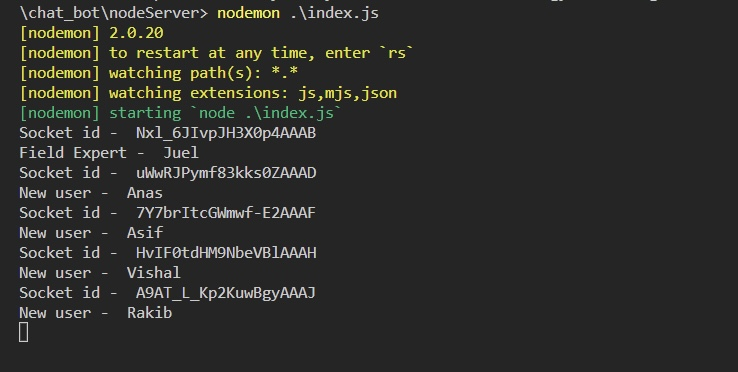
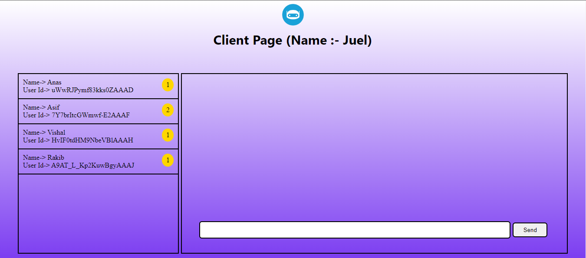
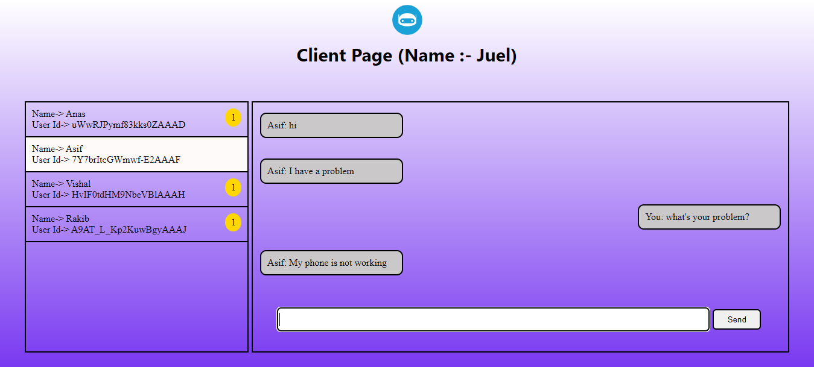
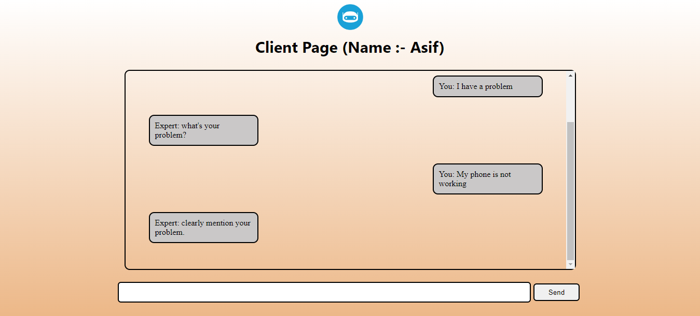
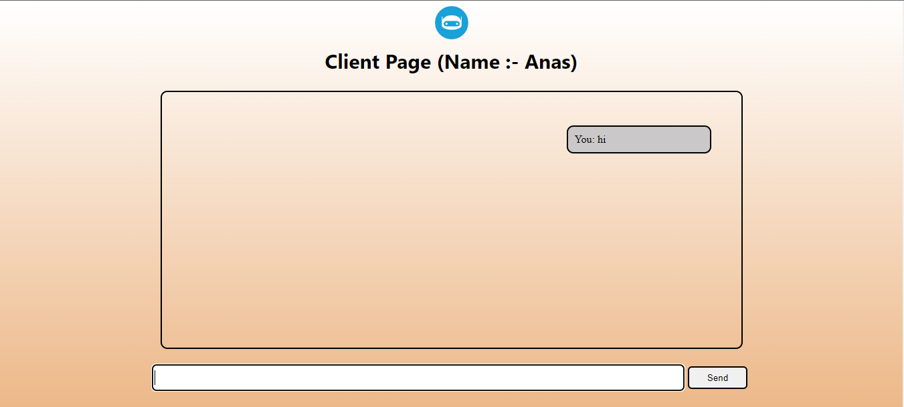
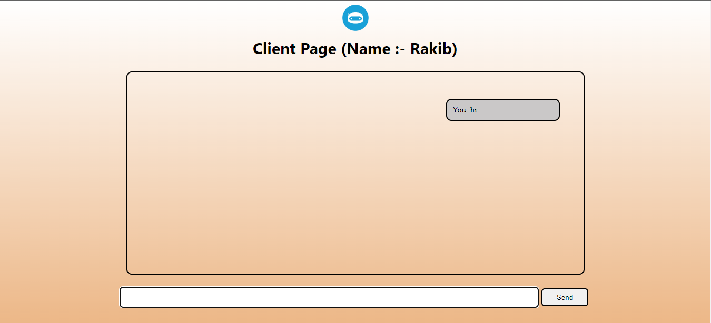
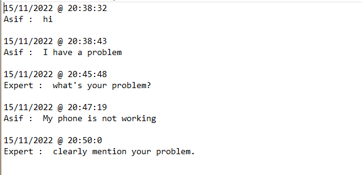

# Chat-Based Customer Support Application

- Developed a real-time chat application to efficiently manage customer inquiries.
- Enabled support agents to assist up to three customers simultaneously.
- Integrated a feature allowing customers to save chat history as a text file.
- **Technologies**: Node.js, Express.js, Socket.IO, JavaScript, HTML, CSS

## Server-Side Console Output

## Expert Output

### Expert Output when clicking on a particular client

### Client page output for - **Asif**

### Client page output for - **Anas**

### Client page output for - **Vishal**

### Client page output for - **Rakib**

## After Disconnecting Client (**Asif**), Contents of the Saved File
